 

# <b>AN5419 Sensorless Single Phase BLDC Motor Control using dsPIC33CK</b>

## <b>1. INTRODUCTION</b>
This document describes the hardware and software setup requirements and step-by-by instructions to run the firmware code referenced in the AN5419 Application Note.

## <b>2. TABLE OF CONTENTS</b>

&nbsp;[1. Introduction](#1-introduction) 
&nbsp;[2. Table of Contents](#2-table-of-contents) 
&nbsp;[3. Requirements](#3-requirements) 
&nbsp;[4. Demonstration Set up for MCLV2](#4-demonstration-set-up-for-mclv2) 
&nbsp;&nbsp;&nbsp;&nbsp;&nbsp;&nbsp;&nbsp;&nbsp;[4.1. Hardware Set up for MCLV2](#41-hardware-setup-for-mclv2) 
&nbsp;&nbsp;&nbsp;&nbsp;&nbsp;&nbsp;&nbsp;&nbsp;[4.2. Software Set up for MCLV2](#42-software-set-up-for-mclv2) 
&nbsp;[5. Demonstration Set up for MCHV3](#5-demonstration-setup-for-mchv3)  
&nbsp;&nbsp;&nbsp;&nbsp;&nbsp;&nbsp;&nbsp;&nbsp;[5.1. Hardware Set up for MCHV3](#51-hardware-set-up-for-mchv3) 
&nbsp;&nbsp;&nbsp;&nbsp;&nbsp;&nbsp;&nbsp;&nbsp;[5.2. Software Set up for MCHV3](#52-software-set-up-for-mchv3) 
&nbsp;[6. References](#6-references) 

## <b>3. REQUIREMENTS </b>

### <b>Motor Control Firmware </b>
<b>Sensorless_SPBLDC.X</b>  
- Navigate MPLAB Discover page of AN5419 and download the ZIP file for firmware *Sensorless_SPBLDC.X*
- Navigate GitHub page of AN5419 and go to <> Code and download the ZIP file for firmware *Sensorless_SPBLDC.X*

### <b>Software Tools Used for testing</b>

- MPLAB® X IDE v6.15 
- dsPIC33CK-MP_DFP v1.12.354
- MPLAB® XC16 Compiler v2.10
- MPLAB® X IDE Plugin X2Cscope v1.6.6 

### <b> Hardware Tools Required for the Demonstration</b>

<table>
  <tr>
    <th>Development Board</th>
    <th>Power Supply</th>
  </tr>
  <tr>
    <td>DSPICDEM™ MCHV3 Development Board (DM3300233)</td>
    <td>250V AC</td>
  </tr>
    <tr>
    <td>DSPICDEM™ MCLV2 Development Board (DM330021-2)</td>
    <td>24V DC</td>
  </tr>
  
</table>
   

## <b> 4. DEMONSTRATION SET UP FOR MCLV2 </b>

### <b> 4.1. HARDWARE SETUP FOR MCLV2 </b>

This section describes hardware setup required to drive the motor using <i>MCLV2 Development Board</i>.

1. Mount the dsPIC33CK256MP508 External Op Amp Motor Control PIM (MA330041-1) on U9 and the External Op Amp Configuration Board on J14.

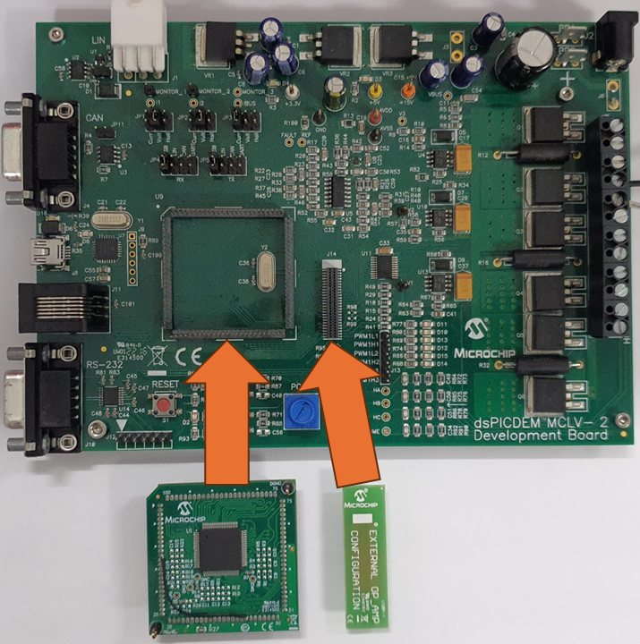

2. Connect the Phase windings of the motor to the J7 terminals labeled M1 and M2, which are located on the right side of the board.

     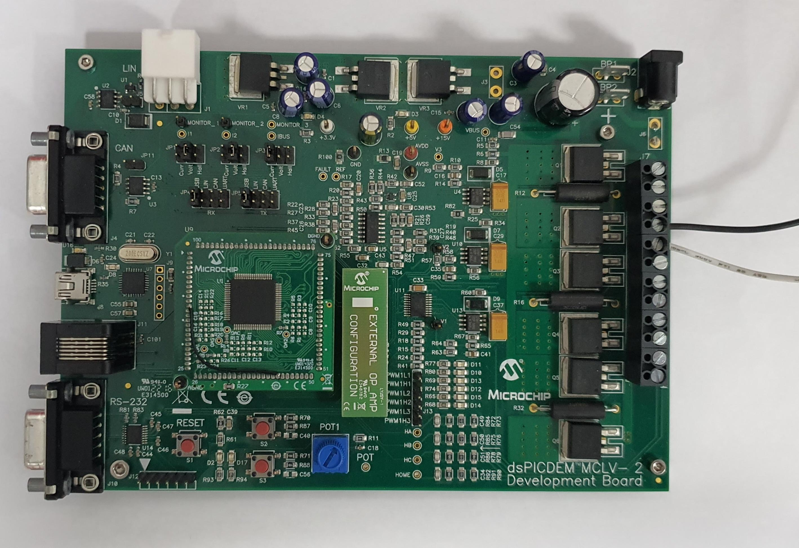

<table>
  <tr>
    <th>Motor Wire</th>
    <th>MCLV2 Board</th>
  </tr>
  <tr>
    <td>Motor Pin A</td>
    <td>M1 (White)</td>
  </tr>
  <tr>
    <td>Motor Pin B</td>
    <td>M2 (Black)</td>
  </tr>
 </table>

   

2. 
 To power the board, plug in the 24V DC power supply to connector J2. J6 connects the bus voltage to the supply but it may be disconnected to use other voltages ranging from 0-48V. Please see MCLV2 User's Guide (Section 2.3) for more information on the power supply options for the development board.

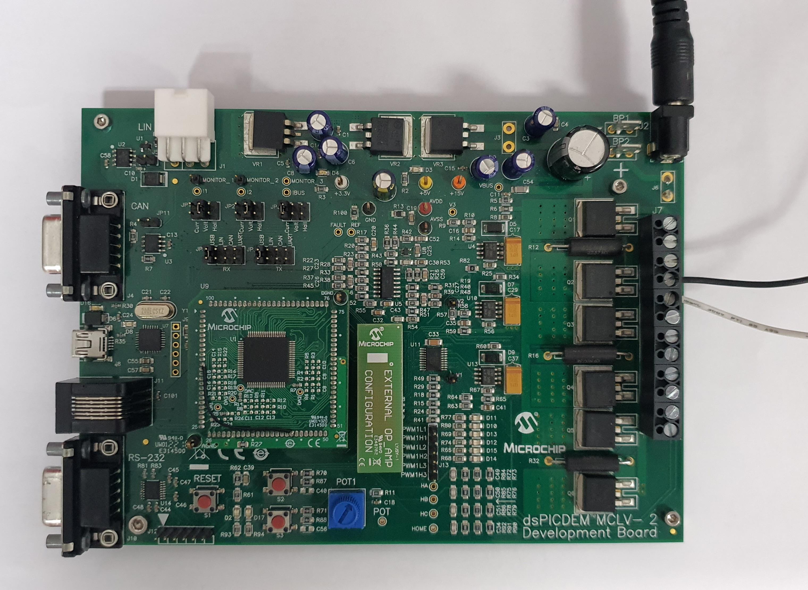

<table>
  <tr>
    <th></th>
    <th>MCLV2 Board</th>
  </tr>
  <tr>
    <td><b>Supply</b></td>
    <td>24V DC</td>
  </tr>
    <tr>
    <td><b>Terminal</b></td>
    <td>J2</td>
  </tr>
</table>

3.	
The MPLAB® PICkit™ 5 in-circuit debugger/programmer is used for programming or debugging the dsPIC33CK DSC. Connect the programmer on the J12 terminal of the board and to the user PC. Make sure the arrow indicated on the board is aligned with the arrow on the Pickit 5.

 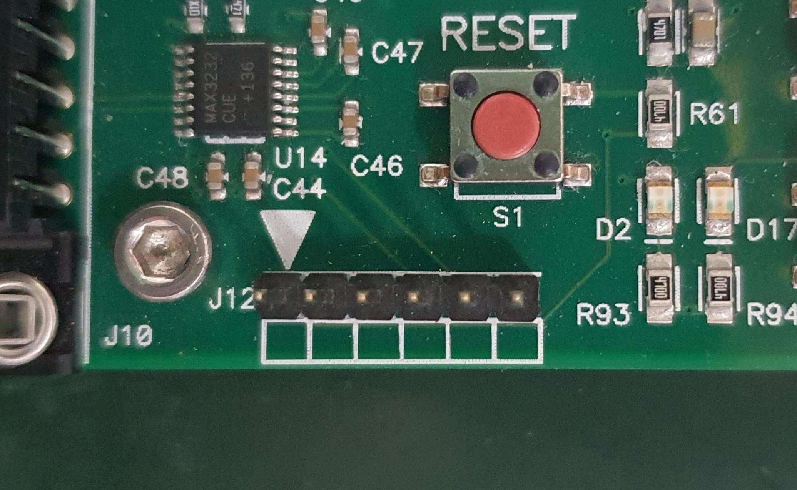

 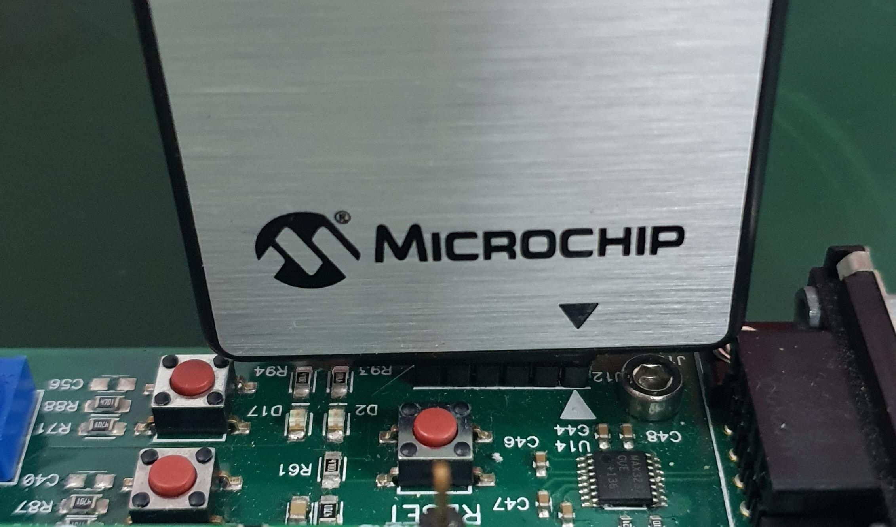

<table>
  <tr>
    <th>Connection </th>
    <th>MCLV2</th>
  </tr>
    <tr>
    <td><b>Programmer</b></td>
    <td>J12</td>
  </tr>
</table>

 

4. X2CScope can be used for real time diagnostics via USB. Short the USB jumper pair in the JP4 and JP5 designator group. Back EMF monitoring can be enabled by shorting the Voltage jumper pair in JP1 and JP2. The current sensing for overcurrent detection can be enabled by shorting the Current jumper pair in JP3.

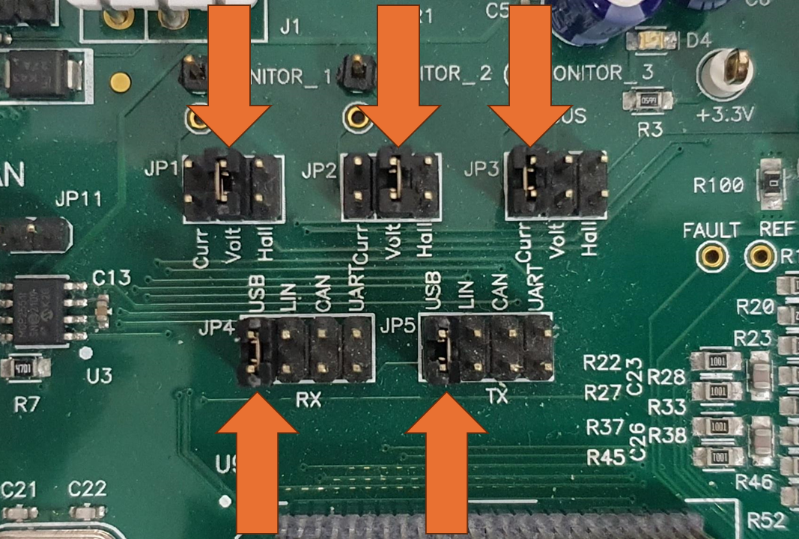

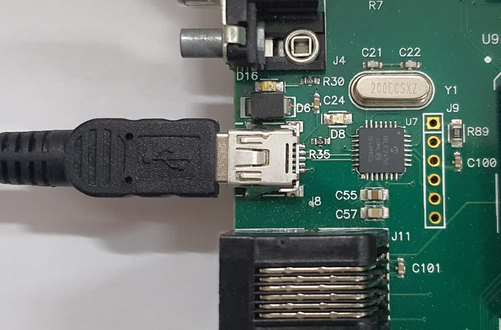

<table>
  <tr>
    <th>Jumper Pairs </th>
    <th>Position </th>
    <th>Label </th>
    <th>Description </th>
  </tr>
  <tr>
    <td>JP1</td>
    <td>3-4</td>
    <td>Volt</td>
    <td>Connects voltage sense phase 1 to MONITOR_1</td>
  </tr>
  <tr>
    <td>JP2</td>
    <td>3-4</td>
    <td>Volt</td>
    <td>Connects voltage sense phase 2 to MONITOR_2</td>
  </tr>
  <tr>
    <td>JP3</td>
    <td>1-2</td>
    <td>Curr</td>
    <td>Connects current sense DC Bus to MONITOR_3</td>
  </tr>
    <tr>
    <td>JP4</td>
    <td>1-2</td>
    <td>USB</td>
    <td>Connects USB receive line to Rx</td>
  </tr>
    </tr>
    <tr>
    <td>JP5</td>
    <td>1-2</td>
    <td>USB</td>
    <td>Connects USB transmit line to Tx</td>
  </tr>
</table>

### <b>4.2. SOFTWARE SET UP FOR MCLV2</b>

#### <b> Firmware Description </b>

This firmware is implemented on Microchip’s 16-bit Digital signal controller (dsPIC® DSC) dsPIC33CK256MP508. It uses peripherals such as the PWM, ADC, TIMER, CMP, UART etc. For more information, see the dsPIC33CK256MP508 Family datasheet (DS70005349).

This motor control demonstration uses the MCLV2 Development board user interface elements such as the push button to start or stop the motor. It uses the MPLAB X IDE plug in X2Cscope to change the speed of the motor. 

Follow the step by step instructions below to setup and run the motor control demo application:

1.  
Start MPLAB X IDE and open  (File > Open Project)  the project <b>SensorlessSPBLDC_MCLV2.X</b>

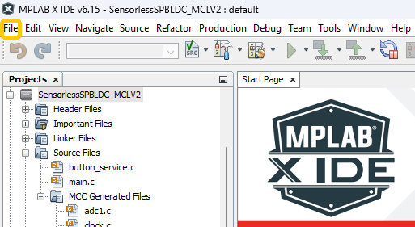

2.  
Set the project <b>SensorlessSPBLDC_MCLV2</b> as main project by right clicking on the project name and selecting 'Set as Main Project' in the drop down menu. The project <b>'SensorlessSPBLDC_MCLV2'</b> will then appear in boldface.

    

     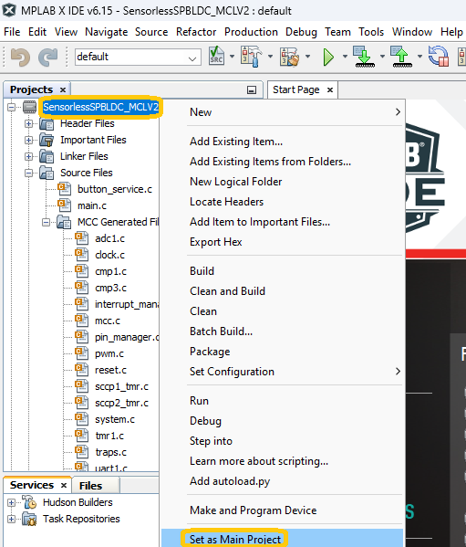

3. 
 Open userparams.h (under SensorlessSPBLDC_MCLV2 > headerfiles) in the project SensorlessSPBLDC_MCLV2 

     

- Enter the bus voltage used for the board. In this case, 24V DC is used.
- Uncomment the defined OVERCURRENT_DETECTION to enable overcurrent detection. 

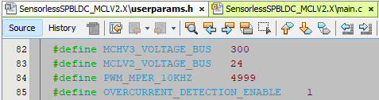

4. Right click on the project SensorlessSPBLDC_MCLV2 and select “Properties”  to open its Project Properties Dialog. In the category window: 

 - Select the dsPIC33CK DFP Pack and Compiler Toolchain from the available list of compilers. Please ensure MPLAB® XC16 Compiler supports the device dsPIC33CK256MP508. In this case, "v1.12.354" and “XC16(v2.10)” are selected.
      

 - Select the Hardware Tool to be used for programming and debugging. 
       
     
 -   After selecting Hardware Tool and Compiler Toolchain, click button <b>Apply</b>
        

        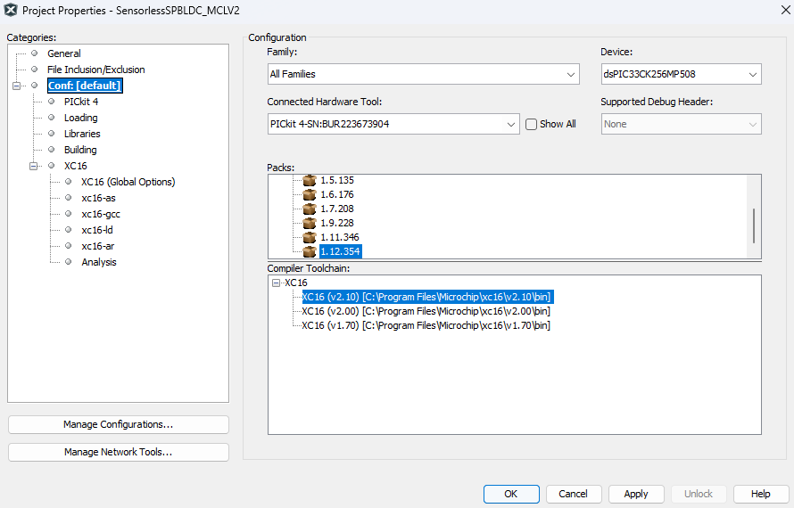

5. 
 Ensure that the checkbox <b>'Load symbols when programming or building for production (slows process)'</b> is checked, which is under the 'Loading' category of the Project Properties window. This is used for X2Cscope. 
        
        
      

      

6. 
To build the project and program the device dsPIC33CK256MP508, click <b>'Make and Program Device Main project'</b> on the toolbar.

    

    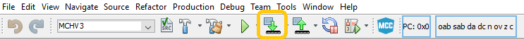

7. 
When the device is programmed successfully, run or stop the motor by pressing the push button S3. The LED D2 should light up to indicate the board is powered and D17 indicates the ON/OFF state of the drive.

     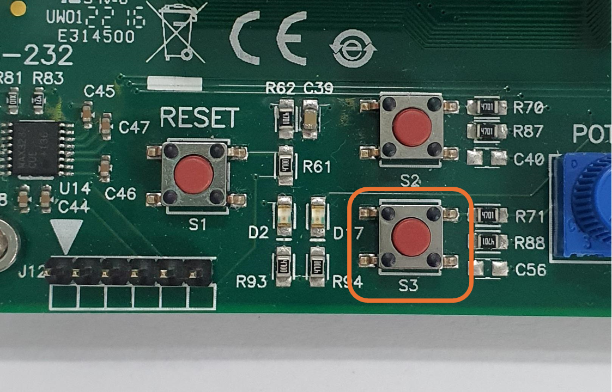

<table>
  <tr>
    <th>Push Button</th>
    <th>Description</th>
  </tr>
  <tr>
  <td>S1</td>
  <td>RESET</td>
  </tr>
  <tr>
  <td>S2</td>
  <td>No Function</td>
  </tr>
  <tr>
  <td>S3</td>
  <td>ON/OFF</td>
  </tr>
</table>

8. 
When the drive is started, the motor runs at the default speed of 500RPM. The variable 'TargetSpeed' can be varied using X2Cscope which can be set up by going to  Tools > Embedded > X2CScope. For Connection Setup, follow as shown in the image below and select the appropriate Serial Port where the USB cable to J8 is connected. Click Disconnected and wait for the label to become Connected. 

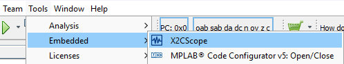

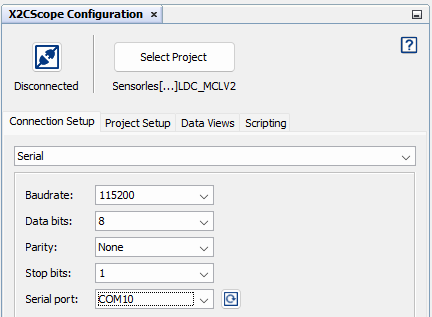

9. 
Once connection is successful, proceed to the Data Views tab and select Open Watch View. This brings you a tab which can monitor and change the variables that X2CScope watches. Click the '+' and Select 'Target Speed' as shown below to change the speed of the motor from the user PC.

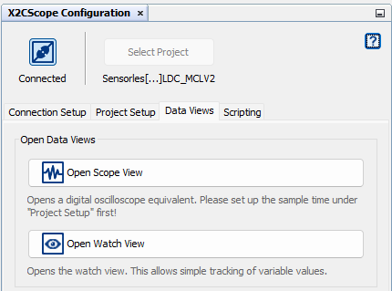

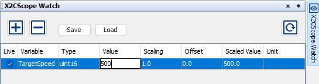

10. 
	Press S3 push button again to stop the motor. 

## <b>5. DEMONSTRATION SETUP FOR MCHV3</b>
### <b> 5.1 HARDWARE SET UP FOR MCHV3 </b>

This section describes hardware setup required to drive the motor using <i>MCHV3 Development Board</i>.

> **_NOTE:_**
> Before making any connection on the MCHV3 Board, verify that the system is not powered and it
is fully discharged. The system is completed discharged when the red
D13 LED is off.

1. 
Mount the dsPIC33CK256MP508 External Op Amp Motor Control PIM (MA330041-1) on U11 and the External Op Amp Configuration Board on J4.

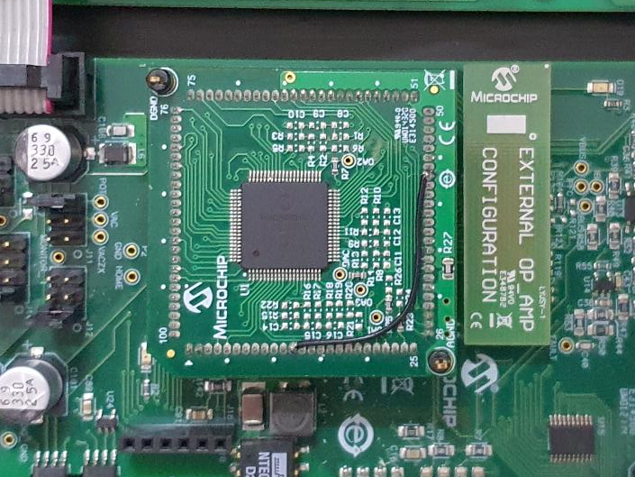

2. 
 Short the appropriate jumper pairs in J12 and J13 for Voltage Feedback and J14 for DC Bus Shunt Current Feedback. J11 is set to POT Voltage as default.

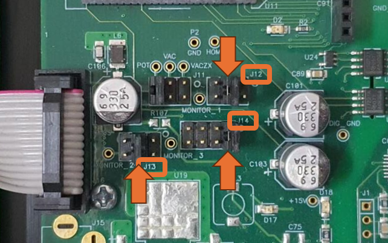

<table>
  <tr>
    <th>Jumper Pairs </th>
    <th>Position </th>
    <th>Description </th>
  </tr>
  <tr>
    <td>J11</td>
    <td>5-6</td>
    <td>Connects the POT Voltage to VACZX_VAC_POT</td>
  </tr>
  <tr>
    <td>J12</td>
    <td>3-4</td>
    <td>Connects Phase M1 Voltage Feedback to MONITOR_1</td>
  </tr>
  <tr>
    <td>J13</td>
    <td>3-4</td>
    <td>Connects Phase M2 Voltage Feedback to MONITOR_2</td>
  </tr>
    <tr>
    <td>J14</td>
    <td>1-2</td>
    <td>Connects DC Bus Shunt Current Feedback to MONITOR_3</td>
  </tr>
</table>

3. 
Connect the phase windings of the motor to the appropriate terminals of the MCHV3 development board, as shown below.

     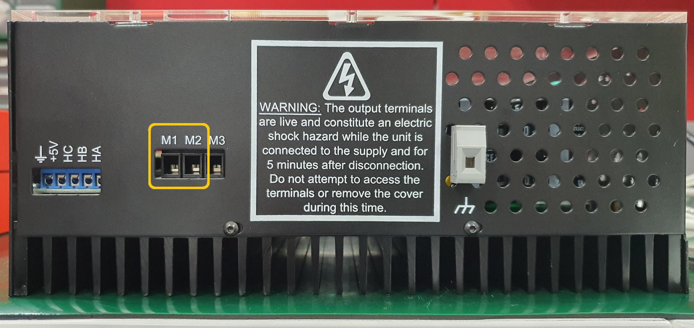

<table>
  <tr>
    <th>Motor Wire</th>
    <th>MCHV3 Board</th>
  </tr>
  <tr>
    <td>Motor Pin A</td>
    <td>M1 (J17)</td>
  </tr>
  <tr>
    <td>Motor Pin B</td>
    <td>M2 (J17)</td>
  </tr>
</table>

3. 
 On the MCHV3 Development Board, use the appropriate AC supply voltage (e.g. 250V AC source) and connect a power adapter to the input socket (J1 Terminal on the board). The table below is provided to summarize the supply and terminal as well. 

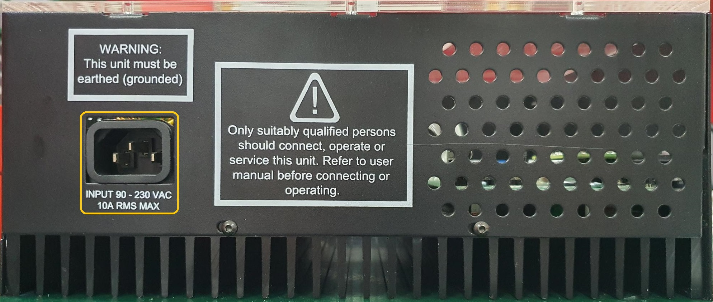

<table>
  <tr>
    <th></th>
    <th>MCHV3 Board</th>
  </tr>
  <tr>
    <td><b>Supply</b></td>
    <td>250V</td>
  </tr>
    <tr>
    <td><b>Terminal</b></td>
    <td>J1</td>
  </tr>
</table>

4.	
The onboard programmer ‘PICkit™ On Board (PKoB4)’, is used for programming or debugging the dsPIC33CK DSC. As shown in the picture of the MCHV3 front panel, use the programmer/debug USB interface to program the board. Use the Connect a connector J13. To enable communication using X2CScope, use a similar cable and connect to J6.

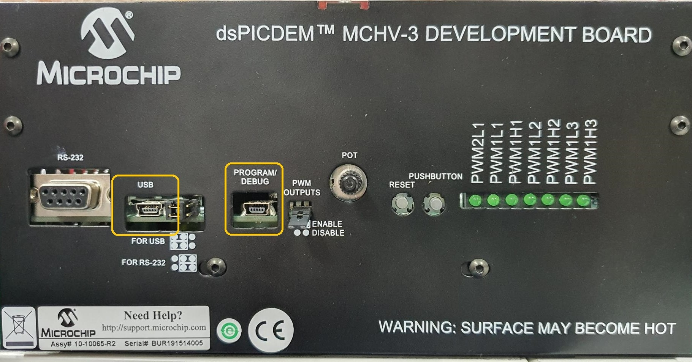

<table>
  <tr>
    <th> Connection </th>
    <th>MCHV3 Board </th>
    <th>Front Panel Label </th>
  </tr>
  <tr>
    <td><b>PKoB4 Programmer</b></td>
    <td>J19</td>
    <td>PROGRAM/DEBUG</td>
  </tr>
    <tr>
    <td><b>USB</b></td>
    <td>J6</td>
    <td>USB</td>
  </tr>
</table>

### <b>5.2 SOFTWARE SET UP FOR MCHV3</b>
#### <b> Firmware Description</b>

This firmware is implemented on Microchip’s 16-bit Digital signal controller (dsPIC® DSC) dsPIC33CK256MP508. 
For more information, see the dsPIC33CK256MP508 Family datasheet (DS70005349).

The Motor Control Demo application uses push button to start or stop the motor and potentiometer to vary speed of the motor. This Motor Control Demo Application configures and uses peripherals like PWM, ADC, SCCP, UART etc.

### Basic Demonstration

Follow below instructions step by step to setup and run the motor control demo application:

1. 
 Start MPLAB X IDE and open (File>Open Project) the project SensoredSPBLDC_MCHV3.X

    

       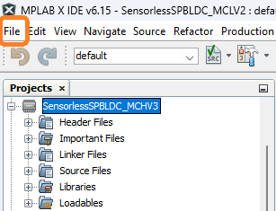

  

2. 
 Set the project SensoredSPBLDC_MCHV3.X as main project by right clicking on the project name and selecting 'Set as Main Project' as shown. The project <b>'SensoredSPBLDC_MCHV3'</b> will then appear in bold.

    

     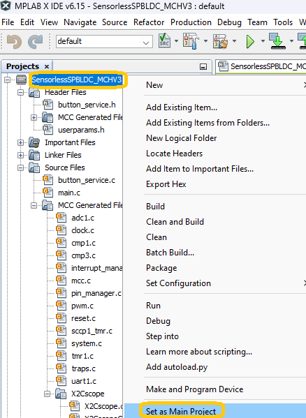

3. 
 Open userparams.h (under SensorlessSPBLDC_MCHV3 > headerfiles) in the project SensorlessSPBLDC_MCHV3 

     

- Enter the bus voltage used for the board. In this case, 300V DC is used.
- Uncomment the defined OVERCURRENT_DETECTION to enable overcurrent detection. 

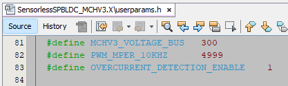

4. 
Right click on the project SensoredSPBLDC_MCHV3.X. In the category window: 

- Select the dsPIC33CK DFP Pack and Compiler Toolchain from the available list of compilers. Please ensure MPLAB® XC16 Compiler supports the device dsPIC33CK256MP508. In this case, "v1.12.354" and “XC16(v2.10)” are selected.
 - Select the Hardware Tool to be used for programming and debugging.     
 - After selecting Hardware Tool and Compiler Toolchain, click button <b>Apply</b>

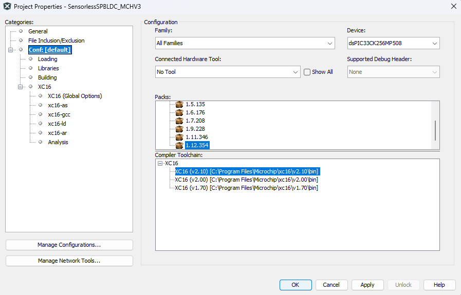

5. 
 Ensure that the checkbox <b>'Load symbols when programming or building for production (slows process)'</b> is checked, which is under the 'Loading' category of the Project Properties window.
        
        
      

      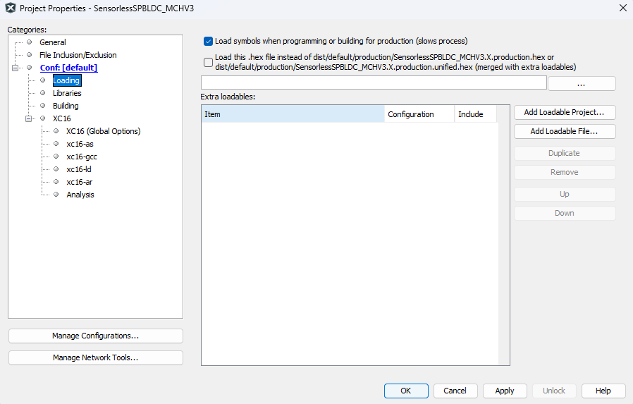

6. 
To build the project (in this case Sensored_SPBLDC_MCHV3_LVMC.X) and program the device dsPIC33CK256MP508, click <b>'Make and Program Device Main project'</b> on the toolbar.

    

    

7. 
 When the device is programmed successfully, run or stop the motor by pressing the push button. The appropriate LEDs should turn on and the motor should start spinning smoothly in one direction in the range indicated by the potentiometer. Ensure that the motor is spinning smoothly without any vibration.

<table>
  <tr>
    <th></th>
    <th>MCHV3 Board</th>
  </tr>
  <tr>
  <td>Push Button</td>
    <td>PUSH BUTTON - ON/OFF

     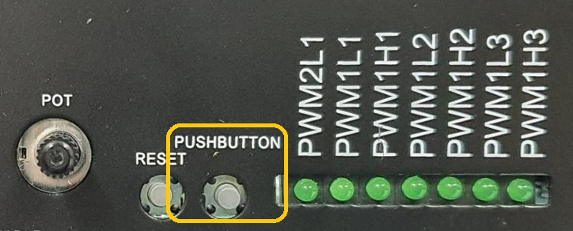
</td>
  </tr>
</table>

8.  
 The motor speed can be varied using the potentiometer of the respective development board as indicated below.

    
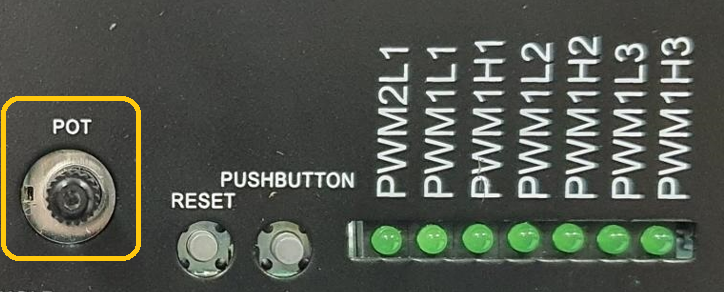

    
9. 
	Press the PUSH BUTTON again to stop the motor.

 
 ## <b>6. REFERENCES</b>
For additional information, refer to the following documents or links.
1. AN5419 Application Note "Sensorless Single Phase BLDC Motor Control using dsPIC33CK"
2. [dsPICDEM™ MCHV3 Development Board User’s Guide](https://ww1.microchip.com/downloads/aemDocuments/documents/OTH/ProductDocuments/UserGuides/DS50002505a.pdf)
2. [dsPIC33CK MCLV2 Motor Control board User's Guide](https://ww1.microchip.com/downloads/aemDocuments/documents/OTH/ProductDocuments/UserGuides/DS-52080a.pdf)
3. [dsPIC33CK256MP508 Family Datasheet (DS70005349)](https://ww1.microchip.com/downloads/en/DeviceDoc/dsPIC33CK256MP508-Family-Data-Sheet-DS70005349H.pdf)

6. MPLAB® X IDE User’s Guide (DS50002027) or MPLAB® X IDE help
7. [MPLAB® X IDE installation](http://microchipdeveloper.com/mplabx:installation)
8. [MPLAB® XC16 Compiler installation](http://microchipdeveloper.com/xc16:installation)

